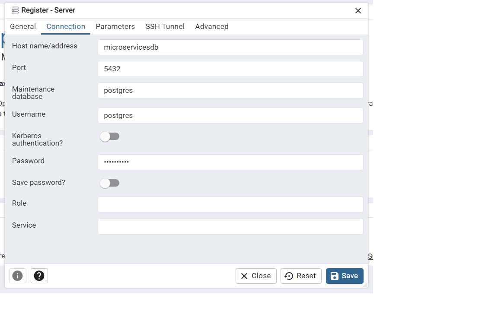

# Microservices Training .NET

## Current Versions of the packages
- Backend
    - .NET 8

> You can find in [here](_docs/api.md) the documentation of the APIs.

### ClientsAPI URLs
[https://clientsapi.127.0.0.1.nip.io:7214]
[https://clientsapi.127.0.0.1.nip.io]
[https://clientsapi.localtest.me]

# Steps To Run Projects (BE and FE)
## - Backend Project 

#### 1. Necessary Programs to Install  
    - Node Js last version from https://nodejs.org/en/download/prebuilt-installer
    - Make sure you have a github account https://github.com
    - Git source control app from https://git-scm.com/download
    - Visual Studio from https://visualstudio.microsoft.com/vs/community/
    - Visual Studio Code from https://code.visualstudio.com/download
    - Docker from https://www.docker.com/products/docker-desktop/

#### 2. Please fork repository from
    - https://github.com/jrodrigoav/coe_net_training_microservices
    
### 3. Clone the fork from your repository
    - git clone https://github.com/your-github-user/coe_net_training_microservices.git

### 4. Run up Docker Containers 
    - Go to the "coe_net_training_microservices" folder
    - Open new command line and Run the following command : 
        - docker compose -f .\docker-compose.yaml --project-name microsvcs up --detach  

        
### 5. Login into the database using pgadmin 
    4.1. URL
         http://localhost:8080/login?next=%2F
    4.2. Credentials 
         Search in the docker-compose.yaml file

### 6. Connect local server to pgadmin
In case your servers section is empty, follow the next steps to attatch the localhost to pgadmin.

    - Right click in Servers section
    - Select Register and then Server...

    - In the first tap (general) put a name for the server
    - In the second tap (connection), put the following information:
      - Host name/address: host.docker.internal
      - Username: postgres
      - Password: *in the compose file*

### 7. Data Bases Schema Setup  
    - Open a new command line 
    - Go to coe_net_training_microservices\backend folder 
    - Open coe_net_microservices.sln solution (Visual Studio)
    - Search, copy and run in the DataBase the SQL Script (ClientsApi, InventoryApi,   RentingAPI, ResourcesAPI)
    
       -Path: APIName\MigrationScripts
       -File: Initial.sql
       
    Note: Execute the file in the pgAdmin from the previous step 

## 8. Setup Secrets for each project
    - On each project you need to right click 
    - Manage User Secrets 
    - Paste the following values in the json file 
        {
          "ConnectionStrings": {
            "MicroservicesDB": "User ID=xxxxx;Password=xxxxx;Host=localhost;Port=5432;Database=postgres;Pooling=true;Connection Lifetime=0;"
          }
        }

    
## 9. Setup appsettings.Development file for each project
    - Go to the appsettings.Development.json file of each project
    
#### 9.1 ClientAPI 
       {
          "Logging": {
            "LogLevel": {
              "Default": "Information",
              "Microsoft.AspNetCore": "Warning"
            }
          },
        }
#### 9.2 InventoryAPI
        {
          "Logging": {
            "LogLevel": {
              "Default": "Information",
              "Microsoft.AspNetCore": "Warning"
            }
          },
          "ResourceAPISettings": {
            "Url": "http://localhost:5183/api/resources"
          }
        }
#### 9.3 RentingAPI
        {
          "Logging": {
            "LogLevel": {
              "Default": "Information",
              "Microsoft.AspNetCore": "Warning"
            }
          },
        }
#### 9.4 ResourceAPI 
        {
          "Logging": {
            "LogLevel": {
              "Default": "Information",
              "Microsoft.AspNetCore": "Warning"
            }
          },
        }
        
## 10. Configure Startup Projects 

    Right click on the project and then select following projects
    -- ClientAPI
    -- InventoryAPI
    -- RentingAPI
    -- ResourcesAPI

Now please build the project and launch it, do not forget to also launch the docker image of the db server.

You can configure Visual Studio to execute all the projects as startup:

  - Right click in the solution
  - Click in properties
  - Select all the api projects

## 10. Connectivity Test 
    - Execute the endPoint : http://localhost:5183/api/resources/list (GET)
      you should see no errors

## [Angular] - Frontend Project - Bookstore
  - Open the command line 
  - Go to frontend/bookstore folder and run the following commands
        npm install
        npm run start

That should give no errors and lauch a server with the UI, which you should be able to access using this url http://localhost:4200/

## [React] - Frontend Project - Bookstore-react
    - Open the command line
    - Go to frontend/bookstore-react folder and run the following commands
        npm install
        npm run build (build project)
        npm run dev (run project)

That should give no errors and lauch a server with the UI, which you should be able to access using this url http://localhost:5173/

## 11. To do
      - Return: It is not working properly. The backend returns a successful response upon returning a resoruce, but the resource is not actually returned.
      - Renting: The backend does not return an error when a user attempts to rent unavailable resources and incorrectly lists unavailable resources as available for rent.